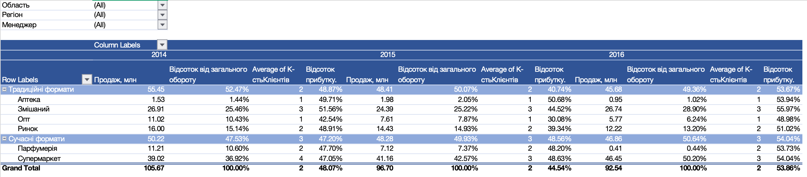

# Sales & Profit Analysis with Pivot Tables

Excel project focused on analyzing sales, customer activity, and profitability across multiple years using Pivot Tables.

## Project Overview

This project was created as part of a learning assignment and demonstrates how Pivot Tables can be used to summarize, compare, and analyze business performance across different years and sales formats.

The report allows performance to be analyzed by year, sales format, turnover contribution, average number of customers, and profit percentage.

## Business Goal

The goal of this project was to compare sales performance across several years, analyze changes in sales channel structure, evaluate customer activity and profitability, and identify the strongest and weakest business segments.

## Tools & Skills

- Microsoft Excel
- Pivot Tables
- Multi-year comparison
- Sales analysis
- Customer analysis
- Profitability analysis
- Percentage of total calculations
- Business reporting
- Data interpretation

## What I Did

- Created a Pivot Table to summarize business performance
- Compared sales results across 2014, 2015, and 2016
- Analyzed traditional and modern sales formats
- Calculated each format's share of total turnover
- Compared the average number of customers across years
- Analyzed profit percentage by sales format
- Identified changes in the sales structure over time
- Used report filters to analyze selected business segments
- Summarized key business findings from the Pivot Table

## Key Insights

- Total sales decreased from **105.67 million** in 2014 to **96.70 million** in 2015 and **92.54 million** in 2016.
- Overall sales declined by approximately **12.4% between 2014 and 2016**.
- Traditional sales formats represented **52.5%** of turnover in 2014, but their share decreased to **49.4%** by 2016.
- Modern sales formats increased their share from **47.5% in 2014** to **50.6% in 2016**, becoming the larger sales channel.
- **Supermarkets** showed the strongest growth: sales increased from approximately **39.02 million** in 2014 to **46.45 million** in 2016.
- The supermarket share of total turnover increased from approximately **36.9%** to **50.2%**.
- **Perfumeries** showed a significant decline, falling from approximately **11.21 million** in 2014 to **0.41 million** in 2016.
- The average number of customers decreased from approximately **2.41** in 2014 to **1.94** in 2016.
- Despite lower sales, the overall profit percentage increased to approximately **53.9% in 2016**, compared with **48.1% in 2014** and **44.5% in 2015**.

## Report Preview

## Excel File

[Open the Excel workbook](files/Pivot-Sales-Profit-Analysis.xlsx)
