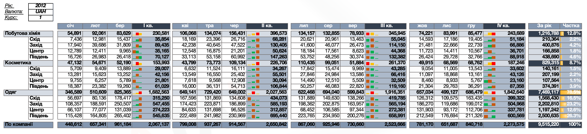

# Sales Performance Analysis

Excel project focused on analyzing sales performance across months, quarters, regions, and product categories.

## Project Overview

This project was created as part of a learning assignment and demonstrates how Excel can be used to structure, summarize, and analyze business data.

## Business Goal

The goal of this project was to analyze sales performance over time, compare results across regions and product categories, and present key metrics in a structured management report.

## Tools & Skills

- Microsoft Excel
- SUMIFS and SUM formulas
- Data aggregation
- Monthly and quarterly analysis
- Regional analysis
- Product category analysis
- Percentage calculations
- Conditional formatting
- Business reporting

## What I Did

- Structured sales data by month, quarter, region, and product category
- Aggregated monthly sales using Excel formulas
- Calculated quarterly and annual sales totals
- Compared performance across product categories
- Calculated each category's share of total annual sales
- Analyzed regional sales performance
- Applied conditional formatting to improve readability
- Created a structured management report for quick performance review

## Key Insights

- Total annual sales reached **9,515,220 UAH**.
- **Clothing** was the dominant product category, generating **7,469,117 UAH**, or approximately **78.5%** of annual sales.
- **Household Chemicals** generated **1,216,788 UAH**, representing approximately **12.8%** of total sales.
- **Cosmetics** generated **829,315 UAH**, or approximately **8.7%** of annual sales.
- **Q2** was the strongest quarter with sales of **2,650,842 UAH**.
- **Q3** followed with **2,523,666 UAH**.
- **Q1** had the lowest quarterly sales at **2,067,137 UAH**.
- The sales structure shows a high dependence on the Clothing category, which accounts for more than three quarters of total annual revenue.

## Report Preview

